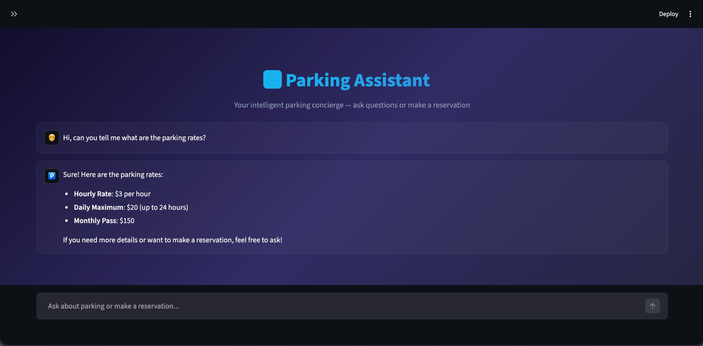
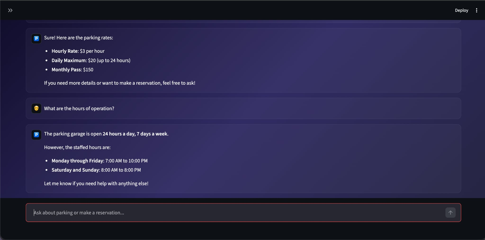
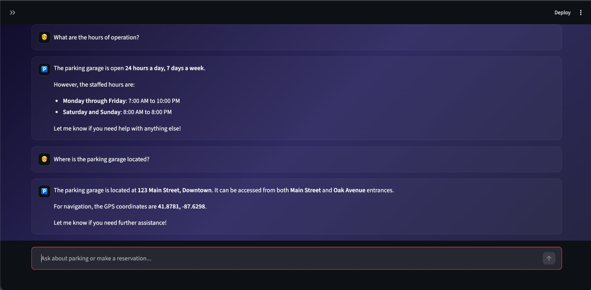
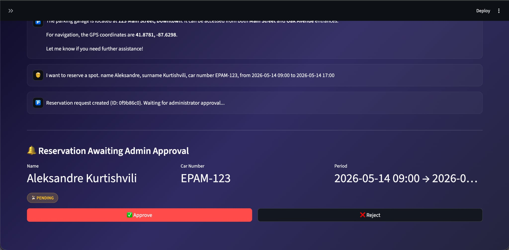
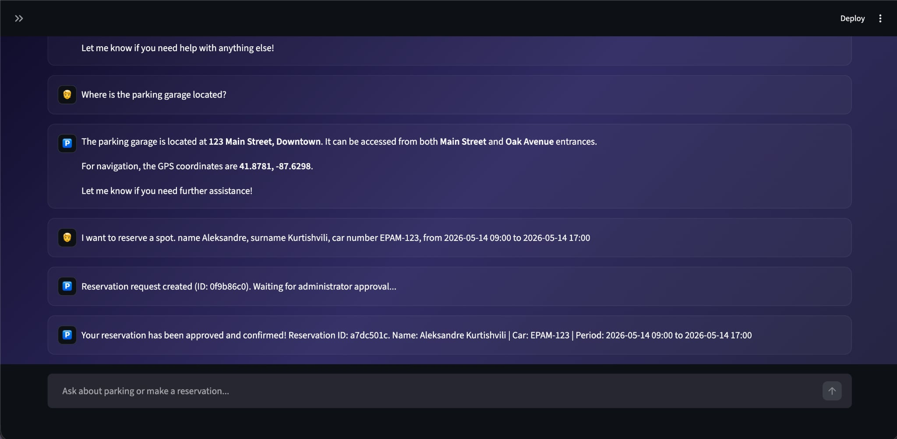
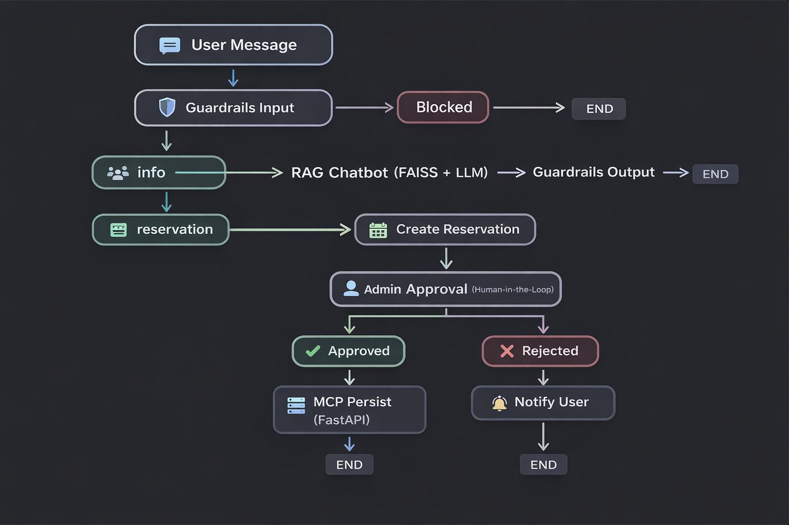

# Parking Assistant

An intelligent parking chatbot with a Streamlit UI, powered by RAG (FAISS + LangChain), LangGraph orchestration, human-in-the-loop admin approval, and a FastAPI MCP server for reservation persistence.

---

## Table of Contents

- [Demo](#demo)
- [Architecture](#architecture)
- [Prerequisites](#prerequisites)
- [Quick Start](#quick-start)
- [Running the App](#running-the-app)
- [Testing](#testing)
- [Evaluation](#evaluation)
- [Terraform Deployment](#terraform-deployment)
- [Project Structure](#project-structure)

---

## Demo

> A real conversation with the Parking Assistant — from general questions to a completed reservation.

**Asking about rates and hours:**





**Asking about location:**



**Making a reservation — admin approval panel appears:**



**Reservation approved and confirmed:**



---

## Architecture

Three components orchestrated via LangGraph:




| Component | Role |
|---|---|
| **RAG Chatbot** | Retrieves parking knowledge from FAISS, generates answers via LLM |
| **Human-in-the-Loop** | Pauses workflow via LangGraph `interrupt()` for admin approve/reject |
| **MCP Server** | FastAPI service that persists reservations to a JSON file |
| **Guardrails** | Blocks prompt injections on input, redacts PII on output |

---

## Prerequisites

- Python 3.11+
- [uv](https://docs.astral.sh/uv/)
- EPAM Dial API key (or any Azure OpenAI-compatible endpoint)

---

## Quick Start

```bash
# 1. Clone
git clone https://github.com/Sandrog112/parking-assistant.git
cd parking-assistant

# 2. Install dependencies
uv sync

# 3. Configure environment
cp .env.example .env
```

Edit `.env` and set your credentials:

```env
DIAL_API_KEY=your-dial-api-key
AZURE_ENDPOINT=https://ai-proxy.lab.epam.com
API_VERSION=2024-02-01
AZURE_DEPLOYMENT=gpt-4o-mini
EMBEDDING_DEPLOYMENT=text-embedding-ada-002
```

```bash
# 4. Build the FAISS vector index
uv run python -m parking_assistant.rag.knowledge
```

---

## Running the App

### Streamlit UI

```bash
uv run streamlit run app.py
```

Opens at `http://localhost:8501`. From the chat interface you can:

- Ask about parking rates, hours, location, EV charging, capacity, and more
- Request a reservation by providing your name, surname, car number, and times
- Approve or reject reservations directly in the UI via the admin panel that appears

### MCP Server

Start in a separate terminal to enable reservation persistence to file:

```bash
uv run uvicorn parking_assistant.mcp.server:app --host 0.0.0.0 --port 8000
```

The MCP server exposes REST endpoints at `http://localhost:8000/reservations` for creating, listing, approving, and cancelling reservations. See the interactive docs at `http://localhost:8000/docs`.

---

## Testing

```bash
uv run pytest tests/ -v
```

| Test file | Coverage |
|---|---|
| `test_guardrails.py` | PII redaction, injection blocking, clean input passthrough |
| `test_reservation.py` | Reservation model defaults, approval decision model |
| `test_mcp.py` | FastAPI endpoints — create, list, approve, reject |
| `test_rag.py` | FAISS retrieval (mocked), empty query handling |
| `test_admin.py` | Full approval/rejection flow with LangGraph interrupt/resume |

All tests use mocks — no external services or API keys required.

---

## Evaluation

The `parking_assistant.evaluation.metrics` module provides built-in retrieval quality metrics including Recall@K, Precision@K, and latency measurement. These can be used to benchmark the RAG pipeline against a set of queries with known relevant documents.

---

## Terraform Deployment

Deploy to AWS EC2:

```bash
cd terraform
terraform init
terraform plan -var="key_name=your-ssh-key"
terraform apply -var="key_name=your-ssh-key"
```

Provisions:
- VPC with public subnet and internet gateway
- Security group (ports 22, 8000)
- EC2 instance (t3.medium, Ubuntu 22.04)
- Auto-setup via user_data script (uv, dependencies, ingestion, server start)

```bash
# Get connection info
terraform output instance_public_ip
terraform output mcp_url

# Tear down
terraform destroy -var="key_name=your-ssh-key"
```

---

## Project Structure

```
parking-assistant/
├── app.py                        # Streamlit UI
├── pyproject.toml                # Dependencies & build config
├── .env.example                  # Environment template
│
├── src/parking_assistant/
│   ├── config.py                 # Settings (EPAM Dial credentials, paths)
│   ├── models.py                 # Pydantic models (Reservation, Approval)
│   ├── rag/
│   │   ├── vectorstore.py        # FAISS index load/save
│   │   ├── retriever.py          # Semantic search
│   │   └── knowledge.py          # Knowledge base ingestion
│   ├── agents/
│   │   ├── chatbot.py            # RAG chatbot + intent classifier
│   │   └── admin.py              # Human-in-the-loop approval node
│   ├── guardrails/
│   │   └── filters.py            # Input/output safety filters
│   ├── mcp/
│   │   └── server.py             # FastAPI reservation server
│   ├── graph/
│   │   ├── state.py              # LangGraph state definition
│   │   └── workflow.py           # Graph orchestration
│   └── evaluation/
│       └── metrics.py            # Recall@K, Precision@K, latency
│
├── tests/                        # pytest suite (18 tests, all mocked)
├── terraform/                    # AWS EC2 deployment
└── data/
    └── parking_knowledge.json    # Parking knowledge base (12 entries)
```
